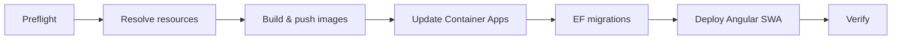

# Manual Code Deployment to Azure

This guide explains how to deploy **application code** (API, Azure Functions, database migrations, and Angular frontend) to an **existing** Azure environment for Intelligence Aggregator.

Infrastructure (resource group, SQL, Key Vault, Container Apps, Static Web App, and so on) must already be provisioned. If you have not deployed infrastructure yet, see [deploy/DEPLOY.md](../../deploy/DEPLOY.md) first.

For a single automated run of all code-deployment steps, you can use the PowerShell script at [deploy/deploy-code.ps1](../../deploy/deploy-code.ps1). The sections below walk through the same workflow **manually**, with context on what each step does and why it matters.

---

## What gets deployed

| Component | Technology | Azure target |
|-----------|------------|--------------|
| Web API | .NET 9 (container) | Container App (API) |
| Background jobs | Azure Functions (container) | Container App (Functions) |
| Database schema | EF Core migrations | Azure SQL Database |
| Web UI | Angular (static build) | Azure Static Web App |

Container images are stored in **GitHub Container Registry (GHCR)** at `ghcr.io/<your-github-username>/`. Azure Container Apps pull those images at runtime using credentials configured during infrastructure deployment.

---

## Prerequisites

Install and verify the following **before** you start. Each tool has a specific role in the pipeline.

| Tool | Purpose | How to verify |
|------|---------|---------------|
| [Azure CLI](https://aka.ms/installazurecli) 2.57+ | Talk to Azure (update apps, read secrets, firewall rules) | `az --version` |
| [Podman](https://podman.io/) (or Docker) | Build and push container images | `podman info` (or `docker info`) |
| [.NET SDK 9](https://dotnet.microsoft.com) | Run EF Core migrations | `dotnet --version` |
| [Node.js 20+](https://nodejs.org/) | Build the Angular app | `node --version` |
| [Static Web Apps CLI](https://www.npmjs.com/package/@azure/static-web-apps-cli) | Upload frontend to SWA | `swa --version` |

Install the SWA CLI globally if needed:

```powershell
npm install -g @azure/static-web-apps-cli
```

### Azure access

You need permission on the target subscription and resource group to:

- Update Container Apps
- Read Key Vault secrets (for SQL connection string)
- Create/delete temporary SQL firewall rules
- Read Static Web App deployment tokens

Sign in and select the correct subscription:

```powershell
az login
az account set --subscription "<YOUR_SUBSCRIPTION_ID>"
az account show
```

### GitHub Container Registry (GHCR)

Create a **classic** personal access token at [GitHub → Settings → Developer settings → Personal access tokens](https://github.com/settings/tokens).

Required scopes:

- `read:packages` — Container Apps pull images at runtime
- `write:packages` — Your machine pushes images during deploy

Keep the token secure; pass it only on the command line or via a prompt, never commit it to the repository.

### Podman vs Docker

The repository’s automation script ([deploy/deploy-code.ps1](../../deploy/deploy-code.ps1)) uses **Podman**. The manual commands below use `podman`; replace with `docker` if that is what you use. Both must be running (e.g. Podman Desktop or `podman machine start`).

---

## Configuration values

Set these once for your session. Replace placeholders with your environment.

| Variable | Example | Meaning |
|----------|---------|---------|
| `RESOURCE_GROUP` | `daily-brefing` | Azure resource group containing all app resources |
| `GHCR_USER` | `your-github-username` | GitHub username owning the GHCR packages |

```powershell
$RESOURCE_GROUP = "<YOUR_RESOURCE_GROUP_NAME>"
$GHCR_USER      = "<YOUR_GITHUB_USERNAME>"
```

---

## Overview of the deployment flow



1. Confirm tools and Azure login.
2. Discover resource names in the resource group.
3. Build and push API and Functions images to GHCR.
4. Point Container Apps at the new image tags.
5. Apply database migrations against Azure SQL.
6. Build and deploy the Static Web App frontend.
7. Smoke-test URLs and health endpoints.

---

## Step 1 — Preflight checks

**What:** Confirm local tooling and Azure authentication work before changing anything in the cloud.

**Why:** Failures later (e.g. mid-migration or after pushing images) are harder to roll back. Catching missing CLI, stopped Podman, or wrong subscription early saves time.

```powershell
# Required commands on PATH
az --version
podman --version   # or docker --version
dotnet --version
node --version
swa --version

# Azure session
az account show

# Container engine running
podman info
```

If `az account show` fails, run `az login` again. If `podman info` fails, start Podman Desktop or your Podman machine.

---

## Step 2 — Resolve Azure resource names

**What:** Query Azure for the names of Container Apps, Static Web App, Key Vault, and SQL Server in your resource group. The Bicep deployment uses a naming pattern with a unique suffix, so names are not fixed in documentation.

**Why:** Subsequent commands need exact resource names. Hard-coding names breaks when you redeploy infrastructure with a different suffix or environment.

Run from any directory (Azure CLI only):

```powershell
$API_APP  = az containerapp list -g $RESOURCE_GROUP --query "[?contains(name,'api') && !contains(name,'-fn-')].name" -o tsv
$FN_APP   = az containerapp list -g $RESOURCE_GROUP --query "[?contains(name,'-fn-')].name" -o tsv
$SWA_NAME = az staticwebapp list -g $RESOURCE_GROUP --query "[0].name" -o tsv
$KV_NAME  = az keyvault list     -g $RESOURCE_GROUP --query "[0].name" -o tsv
$SQL_SRV  = az sql server list   -g $RESOURCE_GROUP --query "[0].name" -o tsv

Write-Host "API Container App : $API_APP"
Write-Host "Fn  Container App : $FN_APP"
Write-Host "Static Web App    : $SWA_NAME"
Write-Host "Key Vault         : $KV_NAME"
Write-Host "SQL Server        : $SQL_SRV"
```

**Understanding the queries:**

- **API app** — Name contains `api` but not `-fn-` (excludes the Functions app).
- **Functions app** — Name contains `-fn-` (Functions Container App).
- **Static Web App / Key Vault / SQL** — First match in the group; typical for a single-environment stack.

If any value is empty, confirm the resource group name and that infrastructure deployment completed successfully.

---

## Step 3 — Build and push container images to GHCR

**What:** Build Docker images for the .NET API and Azure Functions projects, tag them for GHCR, authenticate, and push `latest` (or a version tag you choose).

**Why:** Container Apps do not build code for you. They run whatever image reference you configure. Pushing to GHCR gives a central, versioned artifact both apps can pull from (using the PAT stored as a Container App secret during infra deploy).

Run from the **repository root** (the folder that contains `src/` and `deploy/`). Dockerfiles expect build context at the repo root.

### 3.1 Authenticate to GHCR

```powershell
# PowerShell: prompt securely, or paste token once for the session
$GHCR_PAT = Read-Host -Prompt "GitHub PAT" -AsSecureString
# For manual one-liner login you can use: podman login ghcr.io -u $GHCR_USER
```

```powershell
podman login ghcr.io -u $GHCR_USER
# Enter PAT when prompted
```

### 3.2 Build and push the API image

```powershell
$API_IMAGE = "ghcr.io/$GHCR_USER/intelligence-aggregator-api:latest"

podman build -f src/IntelligenceAggregator.Api/Dockerfile -t $API_IMAGE .
podman push $API_IMAGE
```

**Understanding:**

- `-f .../Dockerfile` — Multi-stage build: restore, publish, runtime image.
- `-t ghcr.io/...` — GHCR host + your namespace + image name + tag.
- Build context `.` — Includes solution files and projects referenced by the Dockerfile.

### 3.3 Build and push the Functions image

```powershell
$FN_IMAGE = "ghcr.io/$GHCR_USER/intelligence-aggregator-functions:latest"

podman build -f src/IntelligenceAggregator.Functions/Dockerfile -t $FN_IMAGE .
podman push $FN_IMAGE
```

**Package visibility:** In GitHub → **Your profile → Packages**, ensure packages are **Private** or **Public** as intended. Private packages require the GHCR credentials configured on the Container Apps during infrastructure deployment.

---

## Step 4 — Update Container Apps to use the new images

**What:** Tell each Container App to deploy a new revision using the image digest/tag you just pushed.

**Why:** Pushing to GHCR does not automatically restart Azure workloads. `az containerapp update --image` creates a new revision and routes traffic to it (rolling update behavior depends on app configuration).

```powershell
az containerapp update `
  --name $API_APP `
  --resource-group $RESOURCE_GROUP `
  --image $API_IMAGE `
  --output none

az containerapp update `
  --name $FN_APP `
  --resource-group $RESOURCE_GROUP `
  --image $FN_IMAGE `
  --output none
```

**What to expect:** Revision provisioning can take one to several minutes. Scale-from-zero apps may cold-start on first request after deploy.

**Optional — force restart without a new image** (e.g. after changing a Key Vault secret):

```powershell
az containerapp revision restart --name $API_APP --resource-group $RESOURCE_GROUP
az containerapp revision restart --name $FN_APP --resource-group $RESOURCE_GROUP
```

---

## Step 5 — Run EF Core database migrations

**What:** Apply pending Entity Framework migrations to the Azure SQL database used by the API.

**Why:** Application code and schema must stay in sync. New API versions may expect tables or columns that only exist after migrations run.

### 5.1 Read connection string from Key Vault

At runtime, apps read `SqlConnectionString` from Key Vault. For local `dotnet ef`, you supply the same secret value as an environment variable.

```powershell
$SQL_CONN = az keyvault secret show `
  --vault-name $KV_NAME `
  --name "SqlConnectionString" `
  --query value -o tsv
```

**Understanding:** The infrastructure deployment stores the SQL connection string in Key Vault. Using Key Vault for manual migrations avoids copying connection strings into scripts or shell history when possible (still treat the value as secret in your session).

### 5.2 Temporary SQL firewall rule

Azure SQL blocks unknown IPs by default. Your workstation’s public IP must be allowed briefly to run migrations.

```powershell
$MY_IP = (Invoke-RestMethod https://api.ipify.org).Trim()
$RULE_NAME = "deploy-temp-$MY_IP"

az sql server firewall-rule create `
  -g $RESOURCE_GROUP `
  -s $SQL_SRV `
  -n $RULE_NAME `
  --start-ip-address $MY_IP `
  --end-ip-address $MY_IP `
  --output none
```

**Why remove the rule afterward:** Leaving broad or stale firewall rules increases exposure. Always delete the rule when migrations finish.

### 5.3 Run migrations

```powershell
$env:ConnectionStrings__DefaultConnection = $SQL_CONN
Push-Location src/IntelligenceAggregator.Api

dotnet ef database update --project ../IntelligenceAggregator.Infrastructure

Pop-Location
$env:ConnectionStrings__DefaultConnection = $null
```

**Understanding:**

- `ConnectionStrings__DefaultConnection` — ASP.NET Core configuration key EF tools read for the default connection.
- `--project ../IntelligenceAggregator.Infrastructure` — Migrations live in the Infrastructure project; startup context is the API project.

### 5.4 Remove the temporary firewall rule

```powershell
az sql server firewall-rule delete `
  -g $RESOURCE_GROUP `
  -s $SQL_SRV `
  -n $RULE_NAME `
  --yes `
  --output none
```

If migration fails, fix the error before deleting the rule if you need to retry from the same machine.

---

## Step 6 — Build and deploy the Angular frontend

**What:** Install npm dependencies, produce a production build, and upload static files to Azure Static Web App using the deployment API key.

**Why:** The UI is not containerized in this architecture; it is hosted on SWA’s CDN. The API URL and environment settings should already be configured for your environment in Angular build configuration.

```powershell
Push-Location src/IntelligenceAggregator.Web

npm install --prefer-offline
npm run build -- --configuration production
```

**Build output:** Artifacts are under `dist/IntelligenceAggregator.Web/browser` (Angular application builder output).

### 6.1 Get SWA deployment token

```powershell
$SWA_TOKEN = az staticwebapp secrets list `
  --name $SWA_NAME `
  --query "properties.apiKey" -o tsv
```

**Understanding:** This token authorizes the SWA CLI to upload files to your Static Web App’s production environment. Treat it like a password.

### 6.2 Deploy with SWA CLI

```powershell
swa deploy ./dist/IntelligenceAggregator.Web/browser `
  --deployment-token $SWA_TOKEN `
  --env production

Pop-Location
```

Propagation to the global CDN may take a few minutes after a successful deploy.

---

## Step 7 — Verify the deployment

**What:** Confirm public endpoints respond and the API reports healthy status.

**Why:** Container Apps and SWA can report success before all replicas are warm. A quick check catches wrong image tags, migration gaps, or frontend/API mismatches.

```powershell
$API_FQDN = az containerapp show -g $RESOURCE_GROUP -n $API_APP `
  --query "properties.configuration.ingress.fqdn" -o tsv

$SWA_URL = az staticwebapp show -g $RESOURCE_GROUP -n $SWA_NAME `
  --query "defaultHostname" -o tsv

Write-Host "Frontend : https://$SWA_URL"
Write-Host "API      : https://$API_FQDN"

Invoke-RestMethod "https://$API_FQDN/health"
```

Open the frontend URL in a browser and exercise critical flows (login, data load) against the new API revision.

---

## Automated alternative (recommended for repeat deploys)

From the repository root, after editing `$RESOURCE_GROUP` and `$GHCR_USER` at the top of the script:

```powershell
.\deploy\deploy-code.ps1
```

The script runs the same seven phases: preflight, resolve names, GHCR build/push, Container App updates, migrations (including firewall rule lifecycle), Angular SWA deploy, and a summary with URLs.

---

## Troubleshooting

| Symptom | Likely cause | What to check |
|---------|----------------|---------------|
| `podman login` or push fails | Invalid PAT or missing `write:packages` | Regenerate PAT; confirm username |
| Container App fails to pull image | Private GHCR package without registry secret | Infra deploy `ghcrPat`; restart revision |
| `dotnet ef` cannot connect | Firewall, wrong connection string, SQL paused | Firewall rule; Key Vault secret; SQL serverless wake-up |
| SWA deploy fails | Wrong token or build path | `az staticwebapp secrets list`; path `dist/.../browser` |
| API 502 after deploy | App crash on startup, missing Key Vault access | Container App logs in Log Analytics / `az containerapp logs show` |
| Health check fails briefly | Cold start | Wait and retry; check replica status |

View recent API logs:

```powershell
az containerapp logs show --name $API_APP --resource-group $RESOURCE_GROUP --tail 50
```

---

## Security reminders

- Do not commit GitHub PATs, SQL passwords, or OpenAI keys to source control.
- Remove temporary SQL firewall rules after migrations.
- Clear `ConnectionStrings__DefaultConnection` from your shell session when done.
- Rotate GHCR PATs periodically and update Container App registry secrets if needed (see infrastructure guide).

---

## Related documentation

- [Infrastructure deployment (Bicep)](../../deploy/DEPLOY.md) — First-time Azure setup, Key Vault secrets, GHCR wiring
- [deploy/deploy-code.ps1](../../deploy/deploy-code.ps1) — Scripted full code deployment
