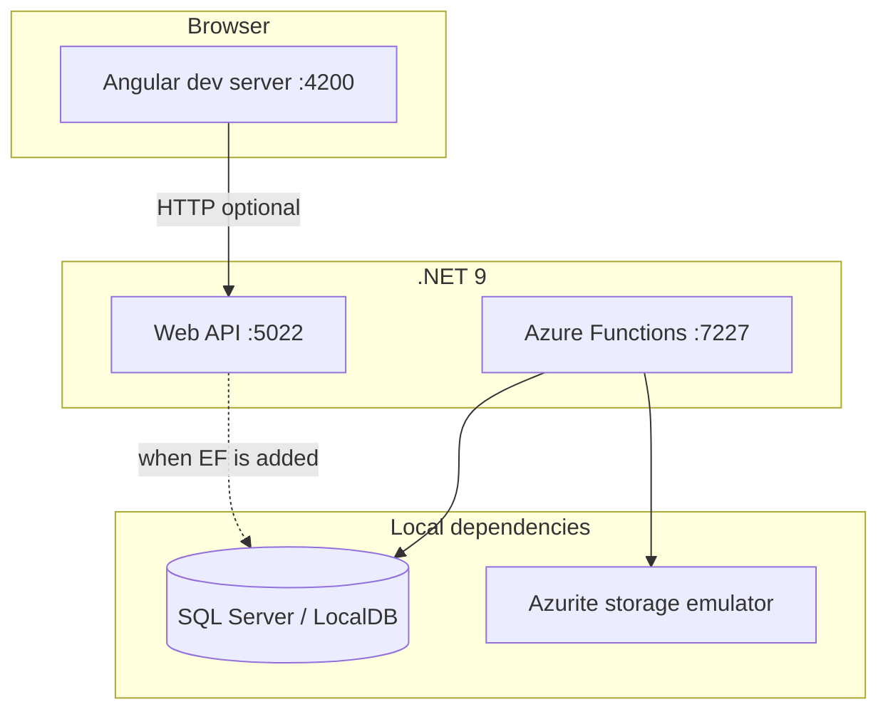

# Local Development Setup

This guide walks through running **Intelligence Aggregator** on your machine for day-to-day development. Each component runs independently; there is no single `docker-compose` file yet.

For deploying to Azure instead, see [deploy/manual-code-deployment.md](deploy/manual-code-deployment.md) and [deploy/DEPLOY.md](../deploy/DEPLOY.md).

---

## Local architecture



| Component | Project path | Default URL |
|-----------|--------------|-------------|
| Angular UI | `src/IntelligenceAggregator.Web` | http://localhost:4200 |
| Web API | `src/IntelligenceAggregator.Api` | http://localhost:5022 |
| Azure Functions | `src/IntelligenceAggregator.Functions` | http://localhost:7227 |

---

## What you can run today

| Goal | Supported? | Notes |
|------|------------|-------|
| Angular UI with hot reload | Yes | Standard `ng serve` |
| API with sample endpoints | Yes | `WeatherForecast` controller; OpenAPI in Development |
| Timer Functions locally | Yes | Requires Azurite + `local.settings.json` |
| Full feature parity with Azure | Partial | Infrastructure layer is still scaffolded (no EF DbContext/migrations in repo yet) |
| One-command full stack | No | Start each process in its own terminal |

---

## Prerequisites

Install these tools once. Versions match what Azure deployment expects where applicable.

| Tool | Version | Purpose | Verify |
|------|---------|---------|--------|
| [.NET SDK](https://dotnet.microsoft.com/download) | 9.0 | API, Functions, future EF migrations | `dotnet --version` |
| [Node.js](https://nodejs.org/) | 20 LTS+ | Angular dev server | `node --version` |
| [Azure Functions Core Tools](https://learn.microsoft.com/azure/azure-functions/functions-run-local) | v4 | Run Functions host (`func start`) | `func --version` |
| [Azurite](https://learn.microsoft.com/azure/storage/common/storage-use-azurite) | latest | Storage emulator for Functions | `azurite --version` |
| SQL Server or [LocalDB](https://learn.microsoft.com/sql/database-engine/configure-windows/sql-server-express-localdb) | optional | Database for Functions settings (when EF is wired) | See Step 3 |

**Optional (not required for minimal local run):**

- [Podman](https://podman.io/) or Docker — only if you want to build/run container images locally
- [Azure CLI](https://aka.ms/installazurecli) — only if pointing local apps at Azure SQL or Key Vault

Clone the repository and open a terminal at the **repo root** (folder containing `src/`, `deploy/`, and `IntelligenceAggregator.sln`).

```powershell
git clone https://github.com/<org>/intelligence-aggregator.git
cd intelligence-aggregator
```

Restore the .NET solution:

```powershell
dotnet restore IntelligenceAggregator.sln
```

---

## Step 1 — Run the Web API

**What:** Starts the ASP.NET Core API in Development mode.

**Why:** The API is the HTTP backend the Angular app will eventually call. In Development, Key Vault is **not** loaded (see `Program.cs`), and CORS allows any origin so the UI on port 4200 can call the API on port 5022.

### 1.1 Start the API

```powershell
cd src/IntelligenceAggregator.Api
dotnet run --launch-profile http
```

Expected output includes a line like:

```text
Now listening on: http://localhost:5022
```

### 1.2 Verify the API

In another terminal:

```powershell
Invoke-RestMethod http://localhost:5022/weatherforecast
```

Or open `src/IntelligenceAggregator.Api/IntelligenceAggregator.Api.http` in Visual Studio / VS Code and run the bundled request.

**OpenAPI (Development only):** Browse to the OpenAPI document endpoint exposed when `ASPNETCORE_ENVIRONMENT=Development` (see ASP.NET Core OpenAPI middleware in `Program.cs`).

### 1.3 Optional — API configuration and secrets

Production settings use Key Vault and connection strings from Azure. Locally you can add values without committing secrets:

**Option A — environment variables (session only)**

```powershell
$env:ConnectionStrings__DefaultConnection = "Server=(localdb)\mssqllocaldb;Database=IntelligenceAggregator;Trusted_Connection=True;"
$env:OpenAI__ApiKey = "<your-openai-key>"
dotnet run --launch-profile http
```

**Option B — User Secrets (recommended when you add real config)**

```powershell
cd src/IntelligenceAggregator.Api
dotnet user-secrets init
dotnet user-secrets set "OpenAI:ApiKey" "<your-openai-key>"
dotnet user-secrets set "ConnectionStrings:DefaultConnection" "Server=(localdb)\mssqllocaldb;Database=IntelligenceAggregator;Trusted_Connection=True;"
```

**Understanding:** Double underscores in environment variables map to nested JSON (`ConnectionStrings__DefaultConnection` → `ConnectionStrings:DefaultConnection`). The API does not read `local.settings.json`; that file is only for the Functions project.

### 1.4 HTTPS profile

The `https` launch profile listens on `https://localhost:7036` and `http://localhost:5022`. Use it if your client requires HTTPS:

```powershell
dotnet run --launch-profile https
```

---

## Step 2 — Run the Angular frontend

**What:** Starts the Angular dev server with live reload.

**Why:** UI work is fastest against `ng serve` rather than rebuilding and deploying to Static Web App on every change.

### 2.1 Install dependencies and start

```powershell
cd src/IntelligenceAggregator.Web
npm install
npm start
```

`npm start` runs `ng serve`. Open http://localhost:4200 in your browser.

### 2.2 Point the UI at the local API (when needed)

There is no `environment.ts` file yet. When you add API calls from Angular, configure a development base URL such as `http://localhost:5022` (HTTP profile avoids mixed-content issues with the dev server on HTTP).

Example pattern (after you add `src/environments/environment.development.ts`):

```typescript
export const environment = {
  production: false,
  apiUrl: 'http://localhost:5022'
};
```

Until then, the UI runs standalone; use the browser network tab or REST client to test the API separately.

### 2.3 CORS

In Development, the API allows all origins (`Cors:AllowedOrigins` defaults to `*`). No extra CORS setup is required for `http://localhost:4200` → `http://localhost:5022`.

---

## Step 3 — Set up local SQL Server (optional)

**What:** A local SQL instance for future EF Core migrations and Functions connection strings.

**Why:** Azure deployment uses Azure SQL. The Functions template already references `Server=localhost;Database=IntelligenceAggregator;...`. When the Infrastructure project adds a DbContext and migrations, you will apply them against this database.

### 3.1 Choose an installation

| Option | Best for | Connection string example |
|--------|----------|---------------------------|
| **SQL Server Express LocalDB** | Windows, lightweight | `Server=(localdb)\mssqllocaldb;Database=IntelligenceAggregator;Trusted_Connection=True;` |
| **SQL Server Developer/Express** | Full SQL features | `Server=localhost;Database=IntelligenceAggregator;Trusted_Connection=True;` |
| **Azure SQL (dev)** | Shared team database | Connection string from Key Vault; add firewall rule for your IP |

**LocalDB — check installation (Windows):**

```powershell
sqllocaldb info
sqllocaldb start MSSQLLocalDB
```

**Create the database (when EF is available):**

```powershell
cd src/IntelligenceAggregator.Api
$env:ConnectionStrings__DefaultConnection = "Server=(localdb)\mssqllocaldb;Database=IntelligenceAggregator;Trusted_Connection=True;"
dotnet ef database update --project ../IntelligenceAggregator.Infrastructure
```

> **Note:** EF Core packages and migrations are not in the repository yet. The command above is the intended workflow once `IntelligenceAggregator.Infrastructure` includes a DbContext. Until then, skip this step or use SQL only if you are developing database scripts manually.

---

## Step 4 — Configure Azure Functions for local run

**What:** Create `local.settings.json` from the checked-in template and set secrets.

**Why:** The Functions host reads `local.settings.json` at startup. It is gitignored so each developer keeps their own keys. Timer triggers also require **AzureWebJobsStorage**, which points to the Azurite emulator in the template.

### 4.1 Copy the template

From the repo root:

```powershell
Copy-Item `
  src/IntelligenceAggregator.Functions/local.settings.json.template `
  src/IntelligenceAggregator.Functions/local.settings.json
```

Edit `src/IntelligenceAggregator.Functions/local.settings.json`:

| Setting | Action |
|---------|--------|
| `OpenAI__ApiKey` | Replace with your OpenAI API key, or leave placeholder if you are not testing AI paths |
| `ConnectionStrings__DefaultConnection` | Match your local SQL choice from Step 3 |
| `Aggregation__*Schedule` | Leave as-is for frequent local timers, or slow down to avoid noise |

**Understanding timer schedules:** Values use NCRONTAB with six fields (including seconds). The template uses every 15–30 minutes for local testing. Production Azure uses twice-daily schedules from Bicep parameters.

---

## Step 5 — Start Azurite (storage emulator)

**What:** Run Azurite so `AzureWebJobsStorage=UseDevelopmentStorage=true` resolves.

**Why:** The Azure Functions runtime uses storage for timer scheduling, lease coordination, and host locks—even when your functions only use timers.

### 5.1 Install Azurite (if needed)

```powershell
npm install -g azurite
```

### 5.2 Start Azurite

In a **dedicated terminal**, from any directory:

```powershell
azurite --silent --location c:\azurite --debug c:\azurite\debug.log
```

Adjust paths as you like. Leave this terminal running while Functions are running.

**Alternative:** [Visual Studio](https://learn.microsoft.com/azure/storage/common/storage-use-azurite#use-azurite-from-visual-studio) and VS Code extensions can start Azurite automatically.

**Default ports:** Blob 10000, Queue 10001, Table 10002.

---

## Step 6 — Run Azure Functions locally

**What:** Start the Functions host with your timer-triggered jobs.

**Why:** News, trend, and briefing aggregation run as isolated worker timer functions (`NewsAggregationFunction`, `TrendAggregationFunction`, `DailyBriefingFunction`). Local runs let you validate schedules and logging without deploying to a Container App.

### 6.1 Build and start

Ensure Azurite is running (Step 5), then:

```powershell
cd src/IntelligenceAggregator.Functions
func start
```

Expected output includes the functions host listening on port **7227** (from `Properties/launchSettings.json`) and lists registered functions.

### 6.2 Verify timer execution

Watch the terminal for log lines such as:

```text
News aggregation started.
```

Triggers fire according to `Aggregation__*Schedule` in `local.settings.json`.

### 6.3 Run without `func` (limited)

You can use `dotnet run` for debugging a single invocation path, but **`func start` is the supported way** to host timer triggers and load `local.settings.json` correctly.

---

## Step 7 — Run the full stack (three terminals)

**What:** Run UI, API, and Functions together for integrated development.

**Why:** Mirrors how the app behaves in Azure (separate processes), without containers.

| Terminal | Directory | Command |
|----------|-----------|---------|
| 1 | `src/IntelligenceAggregator.Api` | `dotnet run --launch-profile http` |
| 2 | `src/IntelligenceAggregator.Web` | `npm start` |
| 3 | (any) | `azurite --silent --location c:\azurite` |
| 4 | `src/IntelligenceAggregator.Functions` | `func start` |

**Minimal stack (UI + API only):** Terminals 1 and 2.

**Smoke test checklist:**

- [ ] http://localhost:4200 loads the Angular app
- [ ] http://localhost:5022/weatherforecast returns JSON
- [ ] Functions terminal shows timer invocations (if Azurite + `local.settings.json` are configured)

---

## Step 8 — Build and test from the solution root

**What:** Compile all .NET projects without running hosts.

**Why:** CI and pre-commit checks; catches breakages across projects.

```powershell
# From repo root
dotnet build IntelligenceAggregator.sln

# Angular production build (optional)
cd src/IntelligenceAggregator.Web
npm run build -- --configuration production
```

Angular unit tests:

```powershell
cd src/IntelligenceAggregator.Web
npm test
```

---

## Development vs Azure behavior

| Concern | Local (Development) | Azure |
|---------|---------------------|--------|
| Key Vault | Not loaded by API (`IsDevelopment()`) | API/Functions use managed identity + Key Vault references |
| CORS | `*` allowed | Specific SWA origin via app settings |
| HTTPS redirect | Enabled in API Development | Disabled in container (ingress terminates TLS) |
| Functions storage | Azurite (`UseDevelopmentStorage=true`) | Azure Storage Account |
| Timer cadence | Short intervals in `local.settings.json.template` | Twice daily (see `deploy/parameters/dev.bicepparam`) |
| Frontend hosting | `ng serve` :4200 | Static Web App CDN |

---

## Troubleshooting

| Problem | Likely cause | Fix |
|---------|----------------|-----|
| `dotnet run` — address already in use | Another API instance on 5022 | Stop the other process or change `applicationUrl` in `launchSettings.json` |
| Angular `EADDRINUSE` :4200 | Dev server already running | Stop the other `ng serve` or `ng serve --port 4201` |
| Functions: storage connection failed | Azurite not running | Start Azurite (Step 5); confirm `UseDevelopmentStorage=true` |
| Functions: `local.settings.json` not found | File not created | Copy from `local.settings.json.template` (Step 4) |
| `func` not recognized | Core Tools not installed | Install Azure Functions Core Tools v4 |
| SQL connection errors | Wrong server name or DB missing | Verify LocalDB/SQL is running; match connection string in `local.settings.json` |
| CORS errors from browser | API not in Development or wrong API URL | Use `http` launch profile; ensure `ASPNETCORE_ENVIRONMENT=Development` |
| OpenAI calls fail | Placeholder API key | Set `OpenAI__ApiKey` in `local.settings.json` or user secrets |

**View Functions logs:** Output appears in the `func start` terminal. Increase verbosity in `host.json` if needed.

**Reset Azurite data:** Stop Azurite and delete the folder passed to `--location`.

---

## Security reminders

- Never commit `local.settings.json`, API keys, or SQL passwords.
- Only `local.settings.json` is gitignored (see `src/IntelligenceAggregator.Functions/.gitignore`). The **template** stays in source control; copy it per machine.
- Use User Secrets or environment variables for the API when you add sensitive configuration.
- Rotate any key that was accidentally committed.

---

## Related documentation

- [Manual code deployment to Azure](deploy/manual-code-deployment.md)
- [Infrastructure deployment (Bicep)](../deploy/DEPLOY.md)
- [Automated code deploy script](../deploy/deploy-code.ps1)
- [Functions local settings template](../src/IntelligenceAggregator.Functions/local.settings.json.template)
